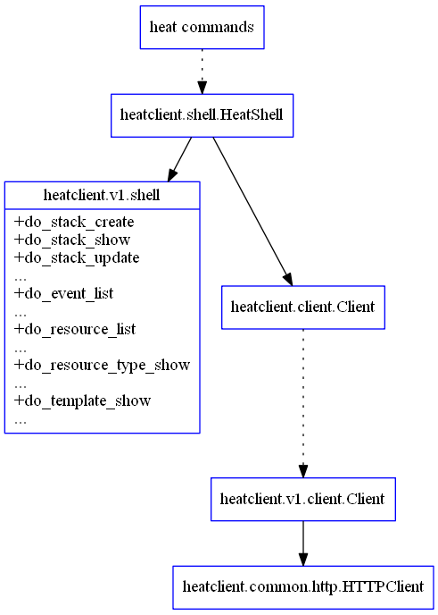

# shell.py
当执行 heat 命令的时候，实际上就是导入了本文件。

查看 /usr/bin/heat 命令的实现代码
```python
import sys
from heatclient.shell import main
if __name__ == "__main__":
    sys.exit(main())
```

即执行了本文件中的 main 方法。

在本文件中，主要是实现了 HeatShell 类，通过 main 函数调用了 HeatShell 类中的 main 函数。

### main 方法
该 main 方法代码十分简单，直接调用 HeatShell 类中的 main 方法。
```python
def main(args=None):
    try:
        if args is None:
            args = sys.argv[1:]

        HeatShell().main(args)
    except KeyboardInterrupt:
        print("... terminating heat client", file=sys.stderr)
        sys.exit(130)
    except Exception as e:
        if '--debug' in args or '-d' in args:
            raise
        else:
            print(strutils.safe_encode(six.text_type(e)), file=sys.stderr)
        sys.exit(1)
```

#### HeatShell 类

##### main
HeatShell 类中 main 方法主要包括三部分。

第一步是注册各种参数和选项。通过下面的代码，先注册基本的命令项，获取通过命令行传入的参数，简单解析一些已知参数，之后通过调用 get_subcommand_parser() 方法来注册预置选项和命令。
```python
# Parse args once to find version
parser = self.get_base_parser()
(options, args) = parser.parse_known_args(argv)
self._setup_logging(options.debug)
self._setup_verbose(options.verbose)

# build available subcommands based on version
api_version = options.heat_api_version
subcommand_parser = self.get_subcommand_parser(api_version)
self.parser = subcommand_parser
```

第二步是对输入参数进行处理，首先调用
```python
args = subcommand_parser.parse_args(argv)
```
利用前面注册的子命令来进行判断和解析。之后根据解析的结果，判断是否是进行补全操作；并检查相应的用户名、口令等信息是否存在，并将这些信息都打包到一起。

最后一步，是创建一个 client，并将前面打包好的参数和命令一起执行。
```python
client = heat_client.Client(api_version, endpoint, **kwargs)
args.func(client, args)
```

其中 client 实际上调用对应版本包下的 client 模块中的 Client 类。以 v1 为例，则为
`heatclient.v1.client.Client`。该客户端中包括能跟服务端进行交互的相关句柄信息。

##### get_subcommand_parser

查看 get_subcommand_parser()方法的代码
```python
def get_subcommand_parser(self, version):
        parser = self.get_base_parser()

        self.subcommands = {}
        subparsers = parser.add_subparsers(metavar='<subcommand>')
        submodule = utils.import_versioned_module(version, 'shell')
        self._find_actions(subparsers, submodule)
        self._find_actions(subparsers, self)
        self._add_bash_completion_subparser(subparsers)

        return parser
```
其中，submodule 实际上指向给定 version 包下的 shell 模块，如果为 v1，则完整路径则为
heatclient.v1.shell 模块。查看该模块，其中定义了大量的 do_xxx 方法，例如 do_create()，do_stack_create()，do_stack_delete()等等。这些方法实际上就对应了相应 heat 命令的调用。

在 self （即本模块）中也分别定义了 do_bash_completion 和 do_help 两个方法。

_find_actions()方法在给定的模块中寻找类似 do_stack_create() 格式的方法，并将“do_”前
缀去掉，下划线改为中划线，即完成 do_stack_create()-->stack-create 命令的转换。

最终在subparsers 中注册上类似 stack-create 的各项命令，以及他们对应的参数、描述和默认的处理函
数（例如 do_stack_create()）。

_find_actions()方法代码为：
```python
def _find_actions(self, subparsers, actions_module):
        for attr in (a for a in dir(actions_module) if a.startswith('do_')):
            # I prefer to be hyphen-separated instead of underscores.
            command = attr[3:].replace('_', '-')
            callback = getattr(actions_module, attr)
            desc = callback.__doc__ or ''
            help = desc.strip().split('\n')[0]
            arguments = getattr(callback, 'arguments', [])

            subparser = subparsers.add_parser(command,
                                              help=help,
                                              description=desc,
                                              add_help=False,
                                              formatter_class=HelpFormatter)
            subparser.add_argument('-h', '--help',
                                   action='help',
                                   help=argparse.SUPPRESS)
            self.subcommands[command] = subparser
            for (args, kwargs) in arguments:
                subparser.add_argument(*args, **kwargs)
            subparser.set_defaults(func=callback)
```

整体的调用过程如下图所示。


